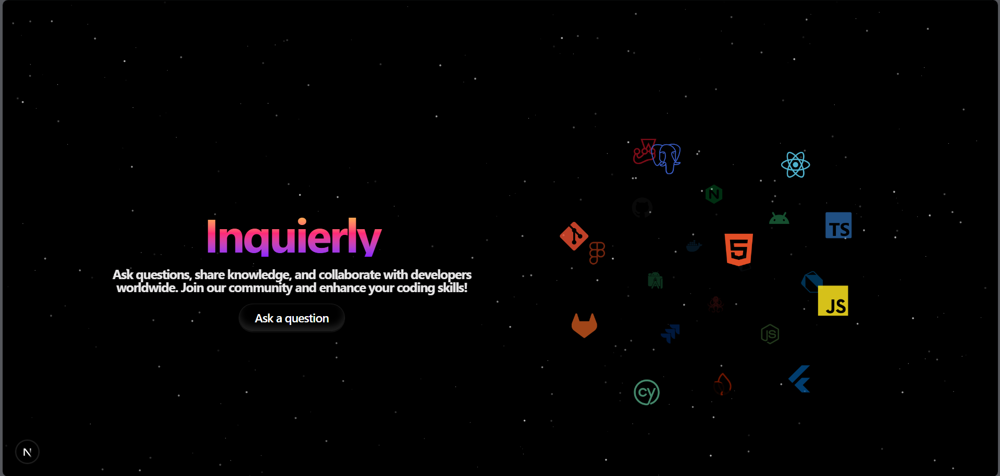

# Inquierly 💡🧠

A Modern Stack Overflow–Inspired Q&A Platform

Inquierly is a full-stack, production-ready Question & Answer web application inspired by Stack Overflow.
It enables developers to ask questions, share knowledge, vote, and collaborate in a visually rich and performant environment.

Built with Next.js App Router, Appwrite, and modern UI/animation libraries, Inquierly focuses on clean UX, real-time data, and scalable architecture.

---

> **Notice:**  
> This project was developed as part of a **Web Development course tutorial assignment** to practice and understand **Next.js**, **TypeScript**, and **full-stack development with Appwrite**.  
> It is intended for **educational and learning purposes** and not for production use.

<p align="center">
  
</p>

## 🚀 Features

### 👤 Authentication & User Profiles

- Secure authentication (Register / Login)
- Public user profiles with:
  - Reputation system
  - Questions asked
  - Answers given
  - Votes received
- Profile editing (owner-only)
- SEO-friendly slug-based profile URLs

---

### ❓ Questions & Answers

- Ask questions with:
  - Title
  - Rich text content
  - Tags
  - Image attachments
- Edit & delete your own questions
- Answer questions
- Upvote / downvote questions and answers
- Search & pagination
- Real-time data updates using Appwrite

---

### 🌌 UI / UX

- Floating navigation bar with active state
- Animated hero section
- Particle & gradient backgrounds
- Icon cloud technology showcase
- Smooth animations and transitions
- Fully responsive layout
- Dark-themed, developer-focused design

---

### ⚙️ Performance & Architecture

- Next.js **App Router**
- Server Components for data fetching
- Client Components only where needed
- Hydration-safe animations
- Clean separation of concerns
- Scalable folder structure

---

## 🧱 Tech Stack

### Frontend

- **Next.js 16 (App Router)**
- **React 18**
- **TypeScript**
- **Tailwind CSS**
- **Framer Motion**
- **Magic UI / Custom UI Components**

### Backend

- **Appwrite**
  - Authentication
  - Databases
  - Storage (image attachments)
  - User management
  - Permissions

### State & Utilities

- Zustand (authentication store)
- Slug generation
- Relative time formatting
- Custom reusable hooks & helpers

---

## 📂 Project Structure

```txt
INQUIERLY-APPWRITE
├── public
│   ├── placeholder.png
│   ├── globe.svg
│   ├── next.svg
│   └── window.svg
│
├── src
│   ├── app
│   │   ├── (auth)
│   │   │   ├── login
│   │   │   ├── register
│   │   │   └── layout.tsx
│   │   │
│   │   ├── api
│   │   │   ├── answer
│   │   │   └── vote
│   │   │
│   │   ├── components
│   │   │   ├── Header.tsx
│   │   │   ├── Footer.tsx
│   │   │   ├── HeroSection.tsx
│   │   │   ├── HeroSectionHeader.tsx
│   │   │   ├── LatestQuestions.tsx
│   │   │   └── TopContributors.tsx
│   │   │
│   │   ├── questions
│   │   │   ├── ask
│   │   │   ├── [quesId]/[quesName]
│   │   │   └── page.tsx
│   │   │
│   │   ├── users
│   │   │   └── [userId]/[userSlug]
│   │   │       ├── answers
│   │   │       ├── questions
│   │   │       ├── votes
│   │   │       ├── edit
│   │   │       ├── Navbar.tsx
│   │   │       ├── layout.tsx
│   │   │       └── page.tsx
│   │   │
│   │   ├── layout.tsx
│   │   └── page.tsx
│   │
│   ├── components
│   │   ├── QuestionForm.tsx
│   │   ├── QuestionCard.tsx
│   │   ├── VoteButtons.tsx
│   │   ├── Pagination.tsx
│   │   └── RTE.tsx
│   │
│   ├── components/ui
│   │   ├── floating-navbar.tsx
│   │   ├── hero-parallax.tsx
│   │   ├── icon-cloud.tsx
│   │   ├── particles.tsx
│   │   ├── magic-card.tsx
│   │   └── number-ticker.tsx
│   │
│   ├── models
│   │   ├── client
│   │   │   └── config.ts
│   │   └── server
│   │       ├── config.ts
│   │       ├── question.collection.ts
│   │       ├── answer.collection.ts
│   │       └── vote.collection.ts
│   │
│   ├── store
│   │   └── Auth.ts
│   │
│   ├── utils
│   │   ├── slugify.ts
│   │   └── relativeTime.ts
│   │
│   └── types
│       └── qna.ts
│
├── .env
├── .env.sample
├── tailwind.config.ts
├── next.config.ts
├── tsconfig.json
├── package.json
└── README.md
```

## 🔐 Environment Variables

```
NEXT_PUBLIC_APPWRITE_HOST_URL=
NEXT_PUBLIC_APPWRITE_PROJECT_ID=
APPWRITE_API_KEY=
```

---

## 🛠️ Setup & Run Locally

```
# Install dependencies
npm install

# Start development server
npm run dev
```

Visit:
👉 http://localhost:3000

---

## 🧠 Key Design Decisions

- Next.js App Router for scalability
- Server Components for data fetching
- Client Components only where interactivity is needed
- Appwrite for backend simplicity
- Reusable UI primitives for consistency

---

## 📚 Inspiration

- Stack Overflow
- GitHub Discussions
- Modern SaaS dashboards
- Developer-first UX principles

---

## 🔎 Contact

- Email: [officialsithumbuddhika@gmail.com](mailto:officialsithumbuddhika@gmail.com)
- LinkedIn: [Sithum Buddhika Jayalal](https://www.linkedin.com/in/sithum-buddhika-jayalal-827860341)
